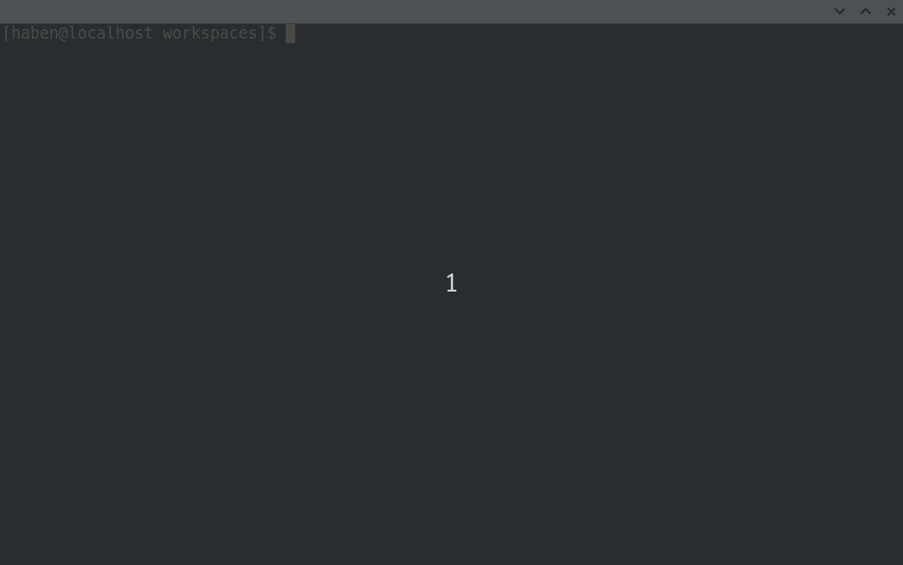

# openrpc-cli

[](https://github.com/habenamare/bounty-openrpc-project/actions)

> a command line tool for OpenRPC

# Table of Contents

- [Installation](#installation)
- [Features](#features)
- [Usage](#usage)
  - [Bundle](#bundle)
  - [Inspect](#inspect)
  - [Validate](#validate)
- [Dependencies](#dependencies)
- [License](#license)

# Installation

## Running from source

```bash
git clone https://github.com/habenamare/bounty-openrpc-project
cd bounty-openrpc-project

npm install   # If using `npm`
yarn          # If using `yarn`

./bin/run     # Run the openrpc-cli program 
```

<p align="center">
  
</p>

## Pack using [pkg](https://github.com/zeit/pkg) to create a single executable

> The single executables created using `pkg` may be too big. This is because they include `Node.js`.

```bash
npm run build # If using `npm`
yarn build    # If using `yarn`

pkg package.json # After running `yarn` or `npm install`
```

# Features

- Make a single OpenRPC document from multiple files that are linked via `$ref`
- Execute JSON-RPC requests to methods defined inside an OpenRPC document
- Validate an OpenRPC document
- YAML support

# Usage

> Use the `help` command or the `--help` option to get more info about the commands and their options.

```bash
openrpc-cli COMMAND [OPTIONS] FILE
```

**FILE** can be either a *JSON* file or a *YAML* file with a `yaml` or `yml` extension.
## Bundle

> Make a single OpenRPC document from multiple files that are linked via `$ref`

```bash
$ openrpc-cli bundle FILE
```

### Options

```
  -f, --format=json|yaml  the output format [default: json]
  -o, --output=<file>     place the output into <file> [default: stdout]
  -s, --substitute        substitute $ref pointers with their resolved value
```

### Examples

```
$ openrpc-cli bundle root-openrpc.json > output.json
$ openrpc-cli bundle root-openrpc.yaml > output.json
$ openrpc-cli bundle root-openrpc.yml > output.json

$ openrpc-cli bundle -f yaml root-openrpc.json > output.yaml

$ openrpc-cli bundle -o output.json root-openrpc.json
$ openrpc-cli bundle -f yaml -o output.yaml root-openrpc.json

$ openrpc-cli bundle -s root-openrpc.json
$ openrpc-cli bundle -s -f yaml root-openrpc.json
$ openrpc-cli bundle -s -f yaml -o output.yaml root-openrpc.json
```

## Inspect

> Execute JSON-RPC requests to methods defined inside an OpenRPC document

```bash
$ openrpc-cli inspect FILE
```

When connecting to a server, the following protocols are supported. 
  - HTTP/HTTPS
  - WebSocket

## Validate

> Validate an OpenRPC document

```bash
$ openrpc-cli validate FILE
```

# Dependencies

This project is inspired by [swagger-cli](https://github.com/APIDevTools/swagger-cli) and it makes use of the following great open-source libraries (in alphabetical order).

 | Dependency  | License |
 | :------------- | :------------- |
 | [ajv](https://github.com/ajv-validator/ajv) | MIT License |
 | [chalk](https://github.com/chalk/chalk) | MIT License |
 | [cli-highlight](https://github.com/felixfbecker/cli-highlight) | ISC License |
 | [Inquirer.js](https://github.com/SBoudrias/Inquirer.js/) | MIT License |
 | [JS-YAML](https://github.com/nodeca/js-yaml) | MIT License |
 | [JSON Schema $Ref Parser](https://github.com/APIDevTools/json-schema-ref-parser) | MIT License |
 | [oclif](https://github.com/oclif/oclif) | MIT License |
 | [OpenRPC Client JS](https://github.com/open-rpc/client-js) | Apache License 2.0 |
 | [tslib](https://github.com/Microsoft/tslib) | BSD Zero Clause License |

# License

This project is under the Apache License 2.0.
